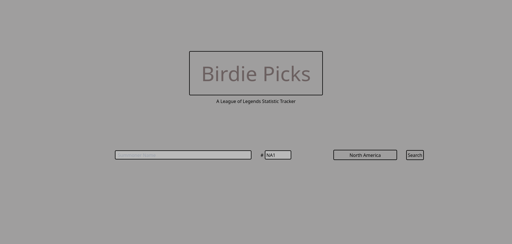
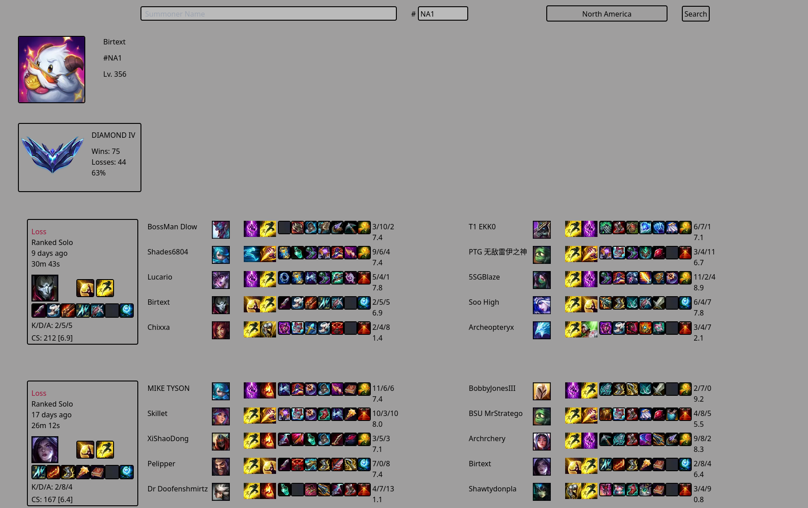

    Welcome to Birdiepicks

    To use the repo, clone and create a .env inside /birdiepicks and populate with RIOT_API

    Then either use docker compose up for fast build of production server or npm run dev for development

